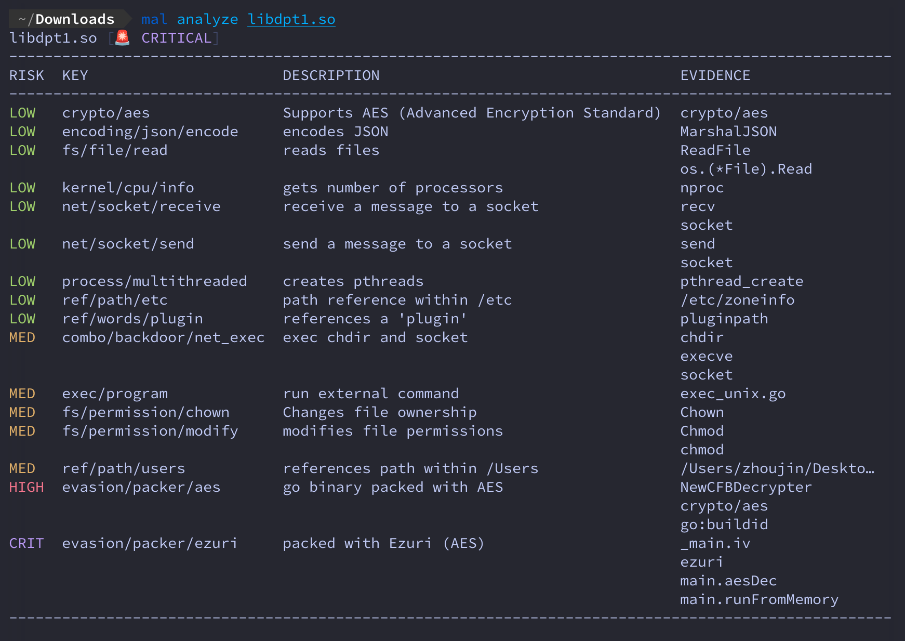

# malcontent

```text
 _ _    _.  .    _   _    _  .  ___   _.   _  .  ___
( | )  (_|  |_  (_  (_)  ( \_)   |   (/_  ( \_)   |
  
     the paranoid open-source malware scanner
```

malcontent is a malware scanner and analysis tool for high-risk environments such as CI/CD pipelines. It's goal is to reveal novel undiscovered malware,
and is overtly paranoid and highly prone to false positives.

malcontent offers 3 modes of operation depending on your use case:

* `analyze`: deep analysis of a programs capabilities
* `diff`: show the capability differences between two versions of a program
* `scan`: basic malware scanner

## Features

* 15,300+ open-source YARA rules
* Analyzes binaries from almost any architecture (arm64, amd64, riscv, ppc64, sparc64), format (ELF, machO, PE),
* Analyzes programs for almost any operating system (Linux, macOS, OpenBSD, FreeBSD, Solaris, Windows)
* Analyzes scripts in almost any language (PERL, Python, shell, Javascript, Typescript, PHP)
* Transparent archive support (`.apk`, `.gem`, `.gz`, `.jar`, `.tar.gz`, `.tar.xz`, `.tar`, `.tgz`, and `.zip`) and OCI archives
* Multiple output formats (JSON, YAML, Markdown, Terminal)
* Includes 3rd party YARA rules from esteemed organizations such as Avast, Elastic, FireEye, Google, JP-CERT, Nextron, and others

## Modes

### Analyze

To analyze a program, pass the path as an argument to `mal analyze`. For example:



The analyze mode emits a list of capabilities that are often seen in malware, categorized by risk level. In general, `CRITICAL` findings should be considered malicious. Useful flags include:

* `--format=json`: output to JSON for data parsing
* `--min-risk=high`: only show high or critical risk findings

### Diff

To detect unexpected capability changes, we have a `diff` mode. Using the [3CX Compromise](https://www.fortinet.com/blog/threat-research/3cx-desktop-app-compromised) as an example:


Each of the lines that beginsl with a "+" represent a newly added capability. For use in CI/CD pipelines, you may find the following flags useful:

It's worth noting that none of the "CRITICAL" findings, except for the `evasion/xor/user_agent`, would have been found pre-3CX compromise. The diff mode is designed to surface subtle unexpected changes that you might not have an explatanion for, such as "why does `libffmpeg.dylib` need access to `chown`?

Useful flags:

* `--format=markdown`: output in markdown for use in GitHub Actions
* `--min-file-risk=critical`: only show diffs for critical-level changes
* `--quantity-increases-risk=false`: disable the heuristics that increase file criticality due to result frequency

### Scan

malcontent can also be used as a simple malware scanner, albeit more paranoid than anything else in open-source:


Like other commands, you can even point this tool at a container image: `mal scan --i cgr.dev/chainguard/nginx`

Useful flags:

* `--include-data-files`: Include files that do not appear to be programs
* `--processes`: scan active process binaries (experimental)

## Installation

### Container

`docker pull cgr.dev/chainguard/malcontent:latest`

### Local

Requirements:

* [go](https://go.dev/) - the programming language
* [pkg-config](https://www.freedesktop.org/wiki/Software/pkg-config/) - for dependency handling, included in many UNIX distributions
* [yara](https://virustotal.github.io/yara/) - the rule language

For example, to install the YARA library on Linux or macOS:

```shell
brew install yara || sudo apt install libyara-dev \
  || sudo dnf install yara-devel || sudo pacman -S yara
```

Install malcontent:

```shell
go install github.com/chainguard-dev/malcontent/cmd/mal@latest
```

## Help Wanted


malcontent is an honest-to-goodness open-source project: if you are interested in contributing, check out [DEVELOPMENT.md](DEVELOPMENT.md)
